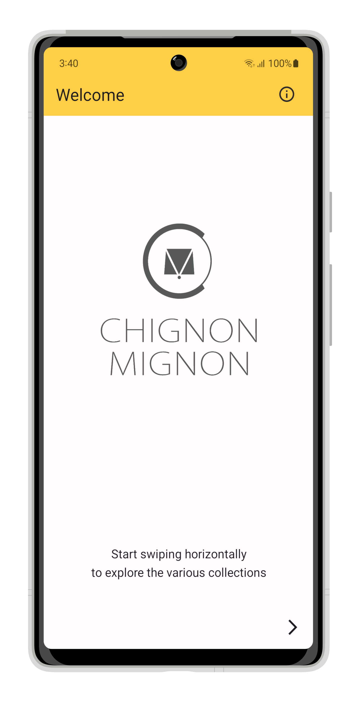
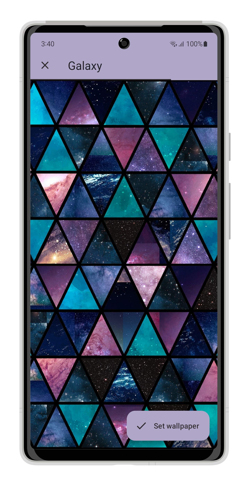
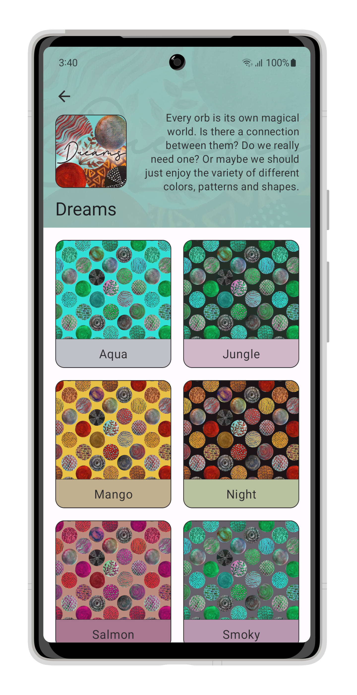
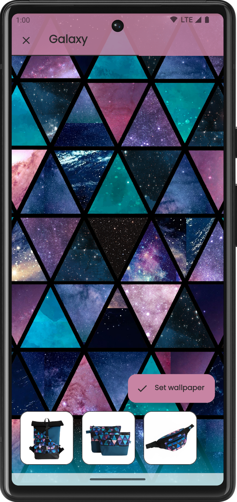
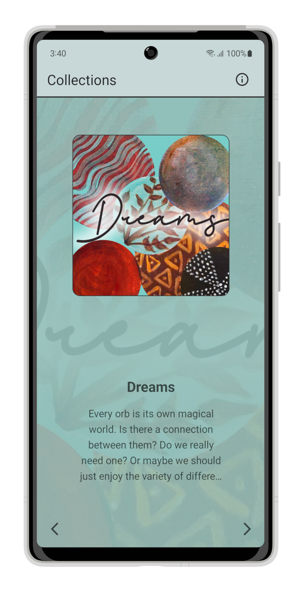
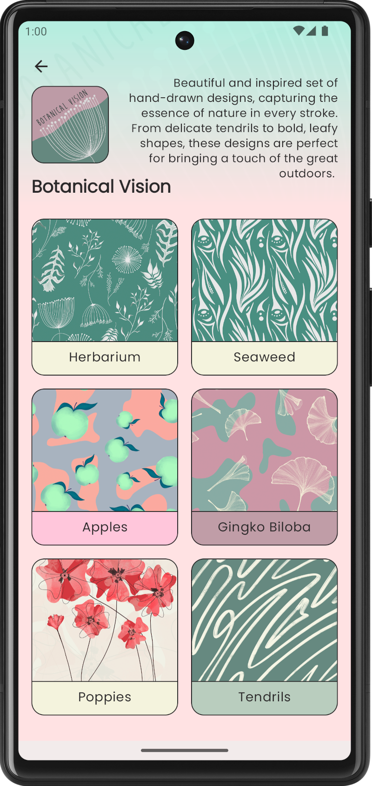

# Chignon Mignon Wallpapers
*Browse the ever-growing collection of wallpaper designs to match the patterns of your favorite bags.*

This simple Android application showcases a number of custom animations and transitions as well as a modular architecture. The data it displays is coming from a public
Google Sheet instead of a dedicated backend. The app features a scalable user interface with proper edge-to-edge support and inset handling in any orientation.

### Screenshots

 
 
 

### License

This software is licensed under GNU GPL 3.0. Any derivative works must follow the same open-source license.

The artwork displayed in the application is the property of [Chignon Mignon](https://chignonmignon.ro/) and should only be used for personal purposes.