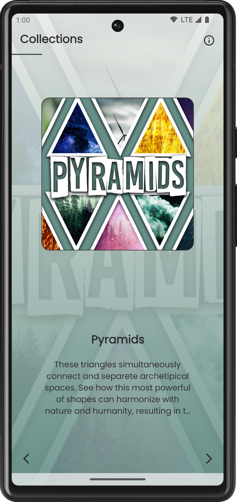
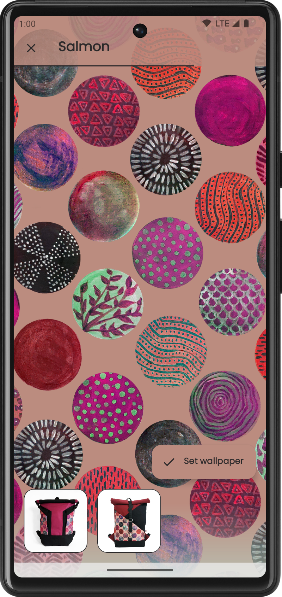
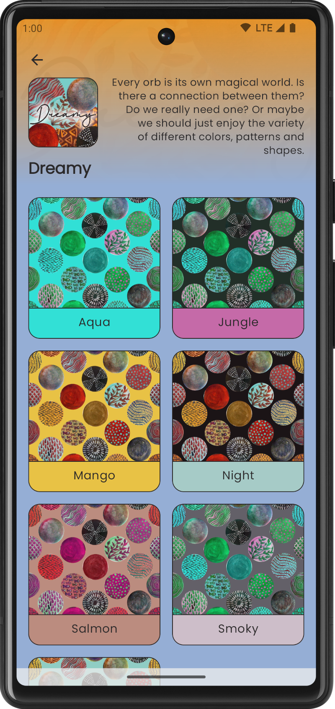
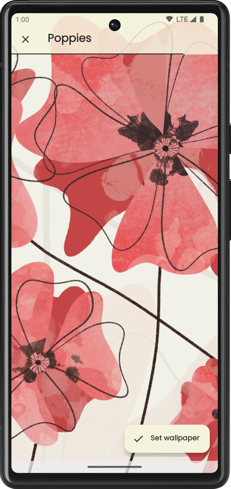

# Chignon Mignon Wallpapers
*Browse the ever-growing collection of wallpaper designs to match the patterns of your favorite bags.*

This simple Android application showcases a number of custom animations and transitions as well as a modular, scalable architecture. The data it displays is coming from a public
Google Sheet instead of a dedicated backend. Other technical features:
- Proper edge-to-edge support with inset handling in any orientation
- Scalable UI
- Support for night mode

### Screenshots

 
 
 

### License

This software is licensed under GNU GPL 3.0. Any derivative works must follow the same open-source license. 